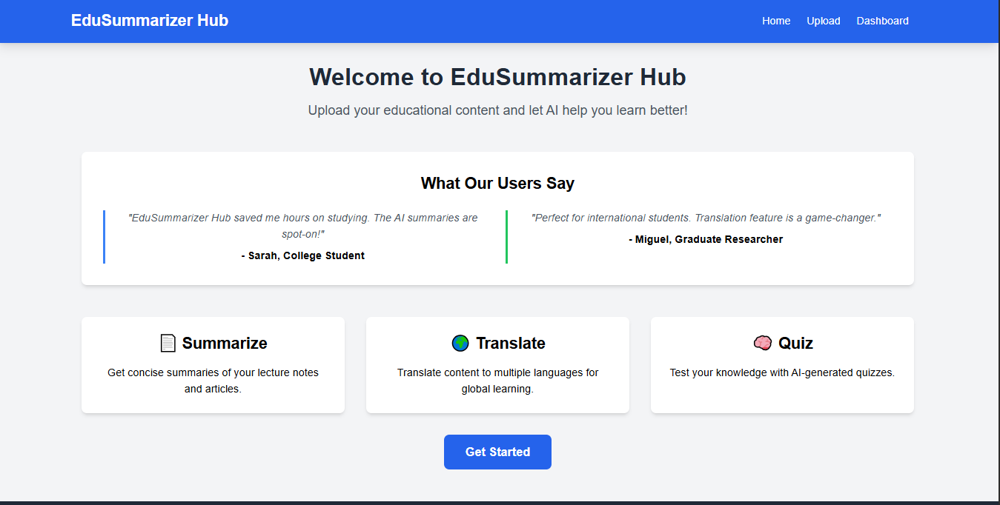
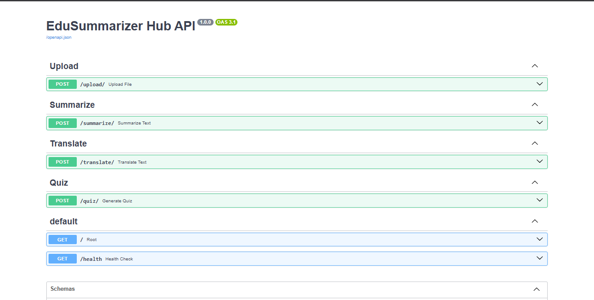
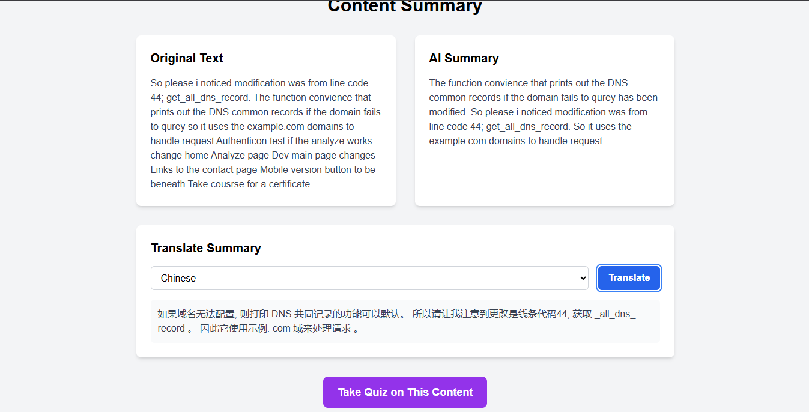

# EduSummarizer Hub

[](https://opensource.org/licenses/MIT)
[](https://www.python.org/)
[](https://fastapi.tiangolo.com/)
[](https://vercel.com)

AI-powered educational content tools for students and educators. Transform your learning materials with intelligent summaries, translations, and interactive quizzes. Built with modern web technologies and deployed on Vercel for seamless performance.

## 📸 Screenshots

### Landing Page


### Upload Interface


### Backend Architecture


### Translation Feature


## 🚀 Features

- **Smart Summaries**: AI-powered text summarization for lecture notes, articles, and documents
- **Global Translation**: Translate content to 8+ languages (Spanish, French, German, Chinese, Japanese, Korean, Italian, Portuguese)
- **Interactive Quizzes**: AI-generated quizzes to test knowledge and reinforce learning
- **File Support**: Upload PDF, DOCX, TXT, CSV, XLSX files or paste text directly
- **Sample Content**: Try the features with pre-loaded educational content
- **Responsive Design**: Works seamlessly on desktop, tablet, and mobile devices

## 🛠️ Tech Stack

### Backend
- **FastAPI**: High-performance Python web framework
- **AI Integration**: Hugging Face Transformers for summarization, OpenAI for translations
- **File Processing**: Support for multiple document formats
- **Caching**: Lightweight in-memory caching for API cost optimization

### Frontend
- **HTML5/CSS3**: Modern responsive design with Tailwind CSS
- **JavaScript**: Vanilla JS with async/await for API interactions
- **Progressive Enhancement**: Works without JavaScript, enhanced with it

## 📦 Installation & Setup

### Prerequisites
- Python 3.8+
- Node.js (for frontend development)
- API keys for Hugging Face and OpenAI
- MongoDB (local or cloud instance)

### Backend Setup
```bash
cd backend
pip install -r requirements.txt
# Set environment variables
export HUGGINGFACE_API_KEY="your-huggingface-api-key"
export OPENAI_API_KEY="your-openai-api-key"
export MONGODB_URL="your-mongodb-connection-string"
# Run the server
uvicorn main:app --reload --host 0.0.0.0 --port 8000
```

### Frontend Setup
```bash
cd frontend
# No build process needed - static files
# Serve locally (optional)
npx http-server -p 3000
```

### Environment Variables
Create a `.env` file in the backend directory:
```
HUGGINGFACE_API_KEY=your-huggingface-api-key
OPENAI_API_KEY=your-openai-api-key
MONGODB_URL=mongodb://localhost:27017/edusummarizer
```

## 🚀 Deployment

### Current Deployment Status

- **Frontend**: Deployed on Vercel (static hosting)
- **Backend**: Deployed on Render (serverless)
- **Database**: MongoDB Atlas (cloud)

### Deployment Instructions

#### Frontend Deployment (Vercel)
```bash
# Install Vercel CLI
npm install -g vercel

# Deploy frontend
cd frontend
vercel --prod
```

#### Backend Deployment (Render)
1. Connect your GitHub repository to Render
2. Set build command: `pip install -r requirements.txt`
3. Set start command: `uvicorn main:app --host 0.0.0.0 --port $PORT`
4. Configure environment variables in Render dashboard

### Environment Variables
- `HUGGINGFACE_API_KEY`: Your Hugging Face API key
- `OPENAI_API_KEY`: Your OpenAI API key
- `MONGODB_URL`: MongoDB connection string
- `GA_MEASUREMENT_ID`: Your Google Analytics Measurement ID (see below)

### Getting Your Google Analytics Measurement ID

1. **Go to Google Analytics**: Visit [analytics.google.com](https://analytics.google.com)
2. **Create/Sign in to Account**: Sign in with your Google account
3. **Set up a Property**:
   - Click "Create Property"
   - Choose "Web" as platform
   - Enter your website details (e.g., name: "EduSummarizer Hub", URL: your deployed domain)
4. **Get Measurement ID**:
   - After creating the property, go to "Admin" (gear icon)
   - Under "Property", click "Data Streams"
   - Click on your web data stream
   - Copy the "Measurement ID" (format: `G-XXXXXXXXXX`)
5. **Replace in Code**: Replace `GA_MEASUREMENT_ID` in all HTML files with your actual ID

**Note**: The Measurement ID is already implemented in the code - developer just need to replace the placeholder with the actual ID from their Google Analytics account.

## 📁 Project Structure

```
EduSummarizerHub/
├── backend/
│   ├── main.py              # FastAPI application
│   ├── cache.py             # In-memory caching
│   ├── routes/
│   │   ├── summarize.py     # Summarization endpoint
│   │   ├── translate.py     # Translation endpoint
│   │   ├── quiz.py          # Quiz generation endpoint
│   │   └── upload.py        # File upload processing
│   ├── requirements.txt     # Python dependencies
│   └── vercel.json          # Vercel deployment config
├── frontend/
│   ├── index.html           # Landing page
│   ├── upload.html          # Upload interface
│   ├── summary.html         # Summary display
│   ├── quiz.html            # Quiz interface
│   ├── dashboard.html       # User dashboard
│   ├── script.js            # Main JavaScript
│   ├── sample-content.js    # Demo content
│   ├── styles.css           # Custom styles
│   ├── package.json         # Node dependencies
│   └── vercel.json          # Vercel deployment config
├── docs/
│   ├── screenshots/         # Application screenshots
│   │   ├── screenshot1.png  # Landing page
│   │   ├── screenshot2.png  # Upload interface
│   │   ├── backend.png      # Backend architecture
│   │   ├── translator.png   # Translation feature
│   │   └── Screenshot 2025-11-03 115608.png  # Dashboard
│   ├── plan.md              # Project planning
│   └── MVP.md               # MVP specifications
├── .gitignore               # Git ignore rules
├── vercel.json              # Root Vercel config (frontend-only)
└── README.md
```

## 🔧 API Endpoints

### POST /upload/
Upload and process files
- **Input**: Multipart form data with file
- **Output**: Extracted text content

### POST /summarize/
Generate AI summary
- **Input**: `{"text": "content to summarize"}`
- **Output**: `{"summary": "generated summary"}`

### POST /translate/
Translate text
- **Input**: `{"text": "text to translate", "target_language": "es"}`
- **Output**: `{"translated_text": "translated content"}`

### POST /quiz/
Generate quiz questions
- **Input**: `{"summary": "summary text", "num_questions": 5}`
- **Output**: `{"questions": [...]}`

## 🎯 Usage

1. **Try Samples**: Click sample buttons on homepage to explore features without uploading
2. **Upload Content**: Drag & drop files (PDF, DOCX, TXT, CSV, XLSX) or paste text directly
3. **Get Summary**: AI generates concise, accurate summaries of your educational content
4. **Translate**: Choose from 8+ languages (Spanish, French, German, Chinese, Japanese, Korean, Italian, Portuguese)
5. **Take Quiz**: Test your knowledge with AI-generated multiple-choice questions
6. **Contact Us**: Use the contact form for feedback, bug reports, or feature requests

## 📊 Current Status

### ✅ Completed MVP Features
- AI-powered summarization using Hugging Face
- Multi-language translation with OpenAI
- Interactive quiz generation
- File upload support (PDF, DOCX, TXT, CSV, XLSX, PPTX)
- Responsive web interface
- Google Analytics integration
- Contact form with feedback collection
- Live deployment on Vercel (frontend) and Render (backend)

### 🔄 Recent Updates
- Added Google Analytics tracking across all pages
- Created contact page with form submission tracking
- Updated navigation to include contact links
- Improved deployment configuration for Render backend
- Enhanced README with current setup instructions

## 🤝 Contributing

1. Fork the repository
2. Create a feature branch
3. Make your changes
4. Test thoroughly
5. Submit a pull request

## 📄 License

MIT License - see LICENSE file for details

## 🙏 Acknowledgments

- Hugging Face for AI model hosting
- OpenAI for translation services
- Tailwind CSS for styling framework
- FastAPI for the backend framework

---

**EduSummarizer Hub** - Making education more accessible and efficient with AI ✨
