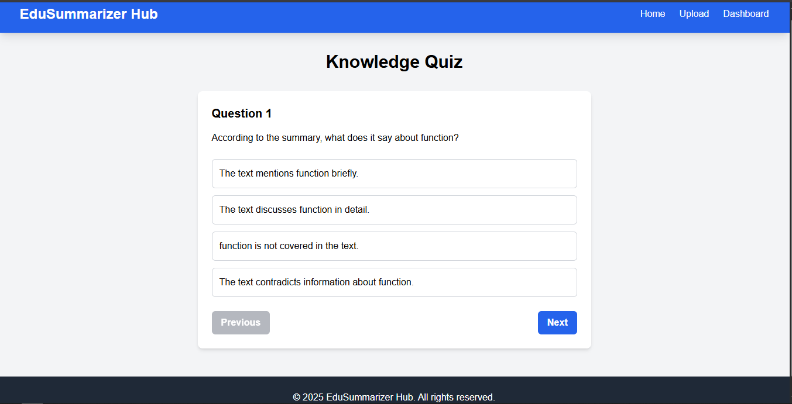

# EduSummarizer Hub

[](https://opensource.org/licenses/MIT)
[](https://www.python.org/)
[](https://fastapi.tiangolo.com/)
[](https://vercel.com)

AI-powered educational content tools for students and educators. Transform your learning materials with intelligent summaries, translations, and interactive quizzes. Built with modern web technologies and deployed on Vercel for seamless performance.

## 📸 Screenshots

### Landing Page


### Upload Interface


### Backend Architecture


### Translation Feature


### Dashboard


## 🚀 Features

- **Smart Summaries**: AI-powered text summarization for lecture notes, articles, and documents
- **Global Translation**: Translate content to 8+ languages (Spanish, French, German, Chinese, Japanese, Korean, Italian, Portuguese)
- **Interactive Quizzes**: AI-generated quizzes to test knowledge and reinforce learning
- **File Support**: Upload PDF, DOCX, TXT, CSV, XLSX files or paste text directly
- **Sample Content**: Try the features with pre-loaded educational content
- **Responsive Design**: Works seamlessly on desktop, tablet, and mobile devices

## 🛠️ Tech Stack

### Backend
- **FastAPI**: High-performance Python web framework
- **AI Integration**: Hugging Face Transformers for summarization, OpenAI for translations
- **File Processing**: Support for multiple document formats
- **Caching**: Lightweight in-memory caching for API cost optimization

### Frontend
- **HTML5/CSS3**: Modern responsive design with Tailwind CSS
- **JavaScript**: Vanilla JS with async/await for API interactions
- **Progressive Enhancement**: Works without JavaScript, enhanced with it

## 📦 Installation & Setup

### Prerequisites
- Python 3.8+
- Node.js (for frontend development)
- API keys for Hugging Face and OpenAI

### Backend Setup
```bash
cd backend
pip install -r requirements.txt
# Set environment variables
export HUGGINGFACE_API_KEY="your-key-here"
export OPENAI_API_KEY="your-key-here"
uvicorn main:app --reload
```

### Frontend Setup
```bash
cd frontend
npm install
npm run dev
```

## 🚀 Deployment

### Vercel Deployment

The project is configured for Vercel deployment with the frontend and backend separated for optimal performance.

#### Frontend Deployment (Static)
The root `vercel.json` configures Vercel to serve the frontend statically:
```json
{
  "version": 2,
  "builds": [
    {
      "src": "frontend/index.html",
      "use": "@vercel/static"
    }
  ],
  "routes": [
    {
      "src": "/(.*)",
      "dest": "frontend/$1"
    }
  ]
}
```

#### Backend Deployment (Separate)
Deploy the backend separately to a serverless platform (e.g., Railway, Render, or AWS Lambda) as Vercel is optimized for frontend-only deployments.

### Environment Variables
- `HUGGINGFACE_API_KEY`: Your Hugging Face API key
- `OPENAI_API_KEY`: Your OpenAI API key

## 📁 Project Structure

```
EduSummarizerHub/
├── backend/
│   ├── main.py              # FastAPI application
│   ├── cache.py             # In-memory caching
│   ├── routes/
│   │   ├── summarize.py     # Summarization endpoint
│   │   ├── translate.py     # Translation endpoint
│   │   ├── quiz.py          # Quiz generation endpoint
│   │   └── upload.py        # File upload processing
│   ├── requirements.txt     # Python dependencies
│   └── vercel.json          # Vercel deployment config
├── frontend/
│   ├── index.html           # Landing page
│   ├── upload.html          # Upload interface
│   ├── summary.html         # Summary display
│   ├── quiz.html            # Quiz interface
│   ├── dashboard.html       # User dashboard
│   ├── script.js            # Main JavaScript
│   ├── sample-content.js    # Demo content
│   ├── styles.css           # Custom styles
│   ├── package.json         # Node dependencies
│   └── vercel.json          # Vercel deployment config
├── docs/
│   ├── screenshots/         # Application screenshots
│   │   ├── screenshot1.png  # Landing page
│   │   ├── screenshot2.png  # Upload interface
│   │   ├── backend.png      # Backend architecture
│   │   ├── translator.png   # Translation feature
│   │   └── Screenshot 2025-11-03 115608.png  # Dashboard
│   ├── plan.md              # Project planning
│   └── MVP.md               # MVP specifications
├── .gitignore               # Git ignore rules
├── vercel.json              # Root Vercel config (frontend-only)
└── README.md
```

## 🔧 API Endpoints

### POST /upload/
Upload and process files
- **Input**: Multipart form data with file
- **Output**: Extracted text content

### POST /summarize/
Generate AI summary
- **Input**: `{"text": "content to summarize"}`
- **Output**: `{"summary": "generated summary"}`

### POST /translate/
Translate text
- **Input**: `{"text": "text to translate", "target_language": "es"}`
- **Output**: `{"translated_text": "translated content"}`

### POST /quiz/
Generate quiz questions
- **Input**: `{"summary": "summary text", "num_questions": 5}`
- **Output**: `{"questions": [...]}`

## 🎯 Usage

1. **Try Samples**: Click sample buttons on homepage to explore features
2. **Upload Content**: Drag & drop files or paste text in the upload form
3. **Get Summary**: AI generates concise summaries of your content
4. **Translate**: Choose target language for translation
5. **Take Quiz**: Test knowledge with AI-generated questions

## 🤝 Contributing

1. Fork the repository
2. Create a feature branch
3. Make your changes
4. Test thoroughly
5. Submit a pull request

## 📄 License

MIT License - see LICENSE file for details

## 🙏 Acknowledgments

- Hugging Face for AI model hosting
- OpenAI for translation services
- Tailwind CSS for styling framework
- FastAPI for the backend framework

---

**EduSummarizer Hub** - Making education more accessible and efficient with AI ✨
